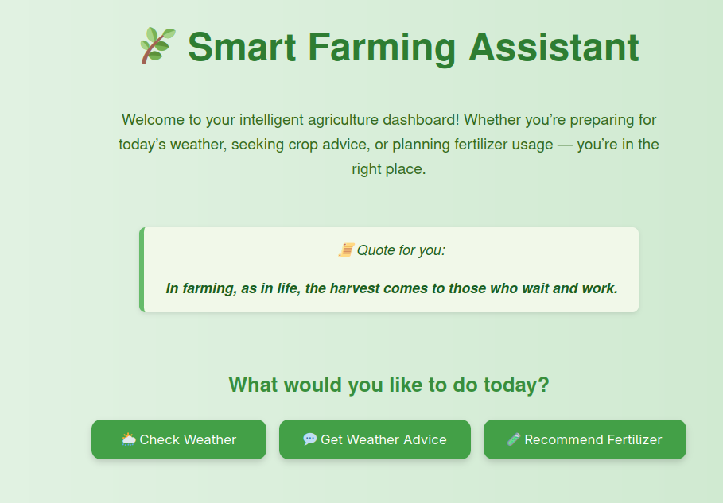
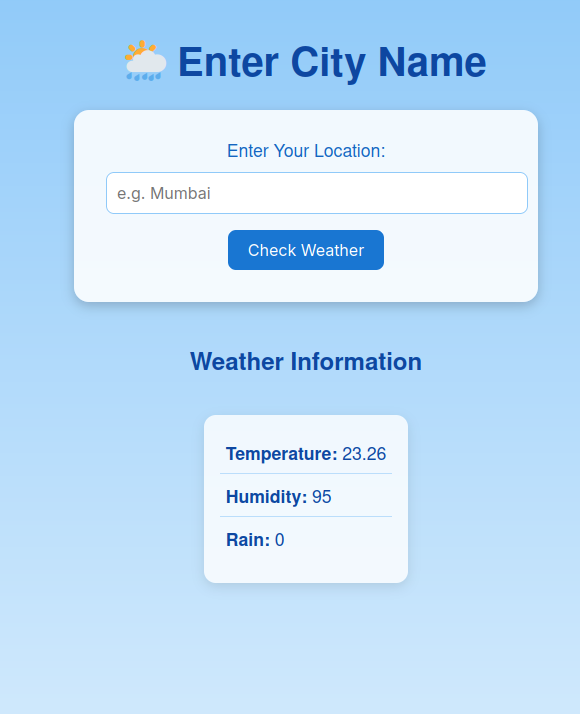
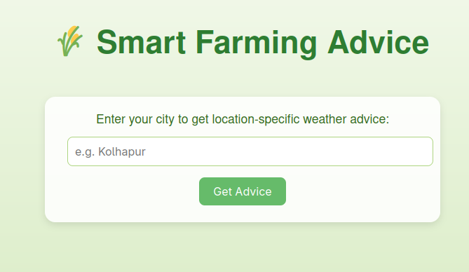
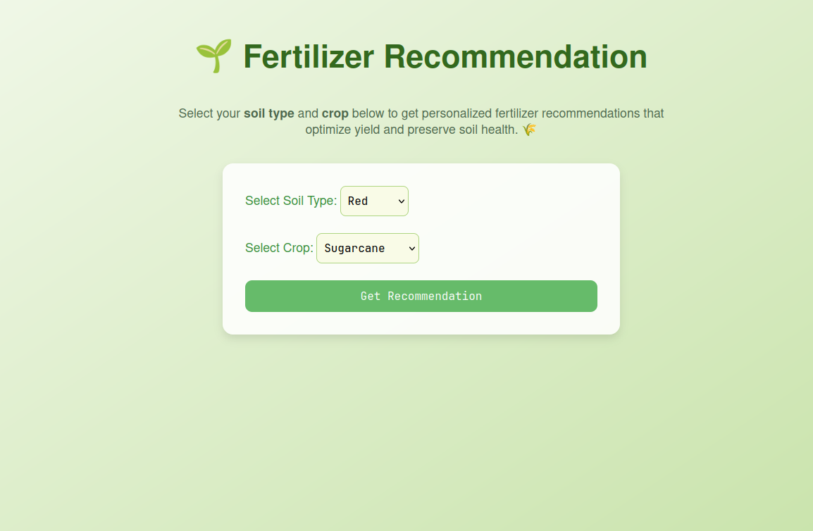

# 🌿 Smart Farming Assistant

A beautifully designed Flask web application that provides real-time agricultural tools for farmers — including weather insights, expert advice, and smart fertilizer recommendations — all in one place.

---

## 📸 Screenshots

### 🏠 Home Page


### 🌦️ Weather Page


### 🌦️ Weather Result


### 💬 Farming Advice


### 🌱 Fertilizer Recommendation


---

## 🚀 Features

- ✅ **Check Local Weather** — Get weather by city input
- ✅ **Receive Farming Advice** — Smart suggestions based on weather
- ✅ **Get Fertilizer Recommendations** — ML-powered predictions
- ✅ **Beautiful UI** — Modern, responsive, and visually appealing
- ✅ **Quote Generator** — Inspirational quote shown on homepage

---

## 📁 Project Structure
```
├── app.py # Main Flask app
├── weather.py # Weather data handling
├── requirements.txt # Python dependencies
├── dataset/
│ ├── fertilizer.csv
│ └── model.ipynb
├── models/
│ └── fertilizer.pkl # Trained fertilizer prediction model
├── templates/
│ ├── index.html
│ ├── weather.html
│ ├── advice.html
│ └── fertilizers.html
└── screenshots/
├── nova_index_new.png
├── nova_weather.png
├── nova_weather_result.png
├── nova_advice.png
└── fert.png
```

---

## 🔧 Installation & Running Locally

1. **Clone the Repository**
   ```bash
   git clone https://github.com/your-username/smart-farming-assistant.git
   cd smart-farming-assistant

2. **Create Virtual Environment (optional but recommended)**
  ```bash
    python -m venv venv
    source venv/bin/activate  # On Windows: venv\Scripts\activate
  ```

3. **Install Requirements**
   ```bash
   pip install -r requirements.txt

4. **Run the App**
   ```bash
   python app.py

5. **Open in Browser**
   Visit http://127.0.0.1:5000

---
